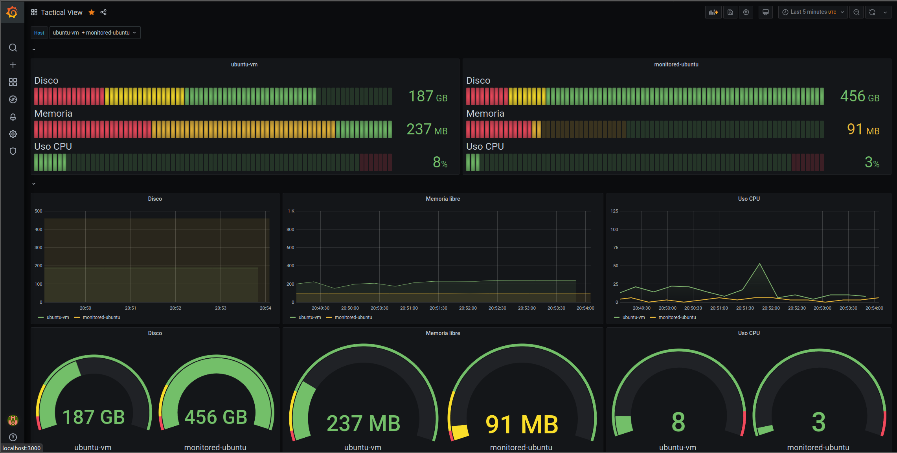

<p align="center">
    
    <br/>
    A simple and hackable system monitor
    <br/> <br/>
    <a href="https://travis-ci.org/da3m0nsec/SimpleMon">
        
    </a>
</p>


# SimpleMon

SimpleMon allows you to monitor multiple systems in an easy way, while being customizable, hackable and secure.

<p align="center">
    
    <br/>
    Example of use with Grafana
    <br/>
</p>


## Dependencies

Compiling:
```
sudo apt install cmake g++ libgcc-7-dev libmysqlcppconn-dev libbotan-2-dev libssl-dev
```

Using Client:
```
sudo apt install libbotan-2-13
```

Using Server:
```
sudo apt install libbotan-2-13 mysql-client mysql-server
```

## Install

Server:
```
git clone https://github.com/da3m0nsec/SimpleMon
cd SimpleMon
./install-server.sh
```

Client:
```
git clone https://github.com/da3m0nsec/SimpleMon
cd SimpleMon
./install-client.sh
```


## Warning: Currently under development !
